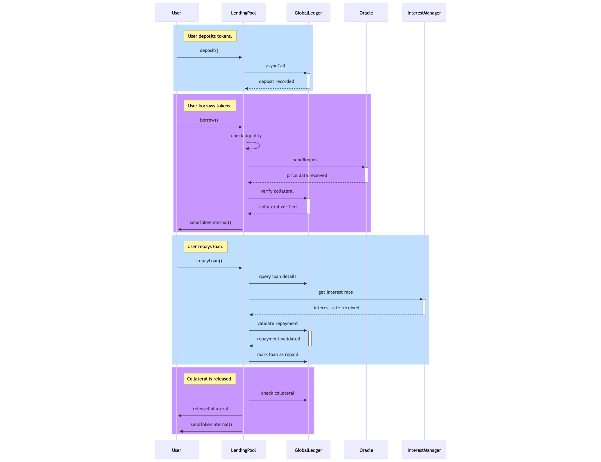

## 🏦 Lending and Borrowing Protocol on =nil;

## 🔍 Overview

This repository contains an **educational example** of a decentralized application (dApp) showcasing a lending and borrowing protocol built on the **=nil;** blockchain. This example demonstrates how to leverage sharded smart contracts, asynchronous communication, and cross-shard interactions using various methods of `nil.sol`. You can learn how to build on **=nil;** by working through this example.

### ✨ Features

- 💰 **Deposit USDT and ETH** into a lending pool
- 🔐 **Borrow assets** based on collateral
- 💳 **Repay borrowed assets** seamlessly
- 📊 **Oracle-based price updates** for accurate valuations

### 🚀 Key Highlights

- 🧩 **Sharded Smart Contracts**: Efficient workload distribution across shards
- ⚡ **Asynchronous Communication**: Transaction execution with minimal bottlenecks
- 🔗 **Cross-Shard Interactions**: Smart contract coordination across different shards

---

### 🔍 Process Flow

The flowchart below illustrates the entire lifecycle of a user interaction in the Lending and Borrowing Protocol, from depositing tokens to repaying loans and collateral release.



---

## ⚙️ Prerequisites

Before working with this repository, ensure you have the following installed:

- 📌 [Node.js](https://nodejs.org/) (version 16 or higher recommended)
- 📦 [npm](https://www.npmjs.com/) (included with Node.js)
- 🔨 Hardhat for smart contract development
- 🌍 A =nil; testnet RPC endpoint(Get one here: [=nil; RPC Bot](https://t.me/NilDevnetTokenBot))
- 🔑 `.env` file with RPC and private key configuration (similar to `.env.example`)

Check your installed versions with:

```sh
node -v
npm -v
```

---

## 📦 Installation

1. 📥 Clone the repository:
   ```sh
   git clone https://github.com/NilFoundation/nil.git
   ```
2. 📂 Navigate to the project root and install dependencies:
   ```sh
   cd nil/academy/lending-protocol
   npm install
   ```
3. 🗂️ **Set up the `.env` file** based on the `.env.example` file:
   - Copy `.env.example` to `.env` and update with your RPC endpoint and private key.
   ```sh
   cp .env.example .env
   ```
4. 🏗️ Compile the smart contracts:
   ```sh
   npx hardhat compile
   ```
5. 🚀 Run the end-to-end lending workflow:
   ```sh
   npx hardhat run-lending-protocol
   ```
   This script deploys **contracts across different shards**, sets up accounts, deposits assets, borrows against collateral, and processes repayments.

---

## 📜 Understanding the `run-lending-protocol` Flow

This command executes the following steps:

1. 🏗 **Deploys contracts** across multiple shards
2. 👥 **Creates smart contract-based accounts**
3. 📊 **Sets and verifies oracle prices** for assets
4. 💸 **Funds accounts with USDT and ETH**
5. 🏦 **Deposits funds** into the lending pool
6. 🔄 **Initiates borrowing** of ETH against USDT
7. ✅ **Processes loan repayment**

Check the `Deep-Dive-Into-The-Protocol` for more detailed explanations and coding patterns when building on top of =nil;

## 🤝 Contribution

This project serves as an example, but contributions are welcome to improve and expand its functionality!

### 💡 How You Can Contribute:

- ✍️ **Enhance lending mechanisms** and introduce new features
- 🔍 **Enable multi token support for lending and borrowing**
- 🛠 **Improve cross-shard execution and smart contract interactions**

📌 Check out our list of open issues: [Issue](https://github.com/NilFoundation/nil/issues).  
📖 For detailed contribution guidelines, refer to [Contribution Guide](https://github.com/NilFoundation/nil/blob/main/CONTRIBUTION-GUIDE.md)

🚀 **Thank you for your support, and happy building!** 🎉
