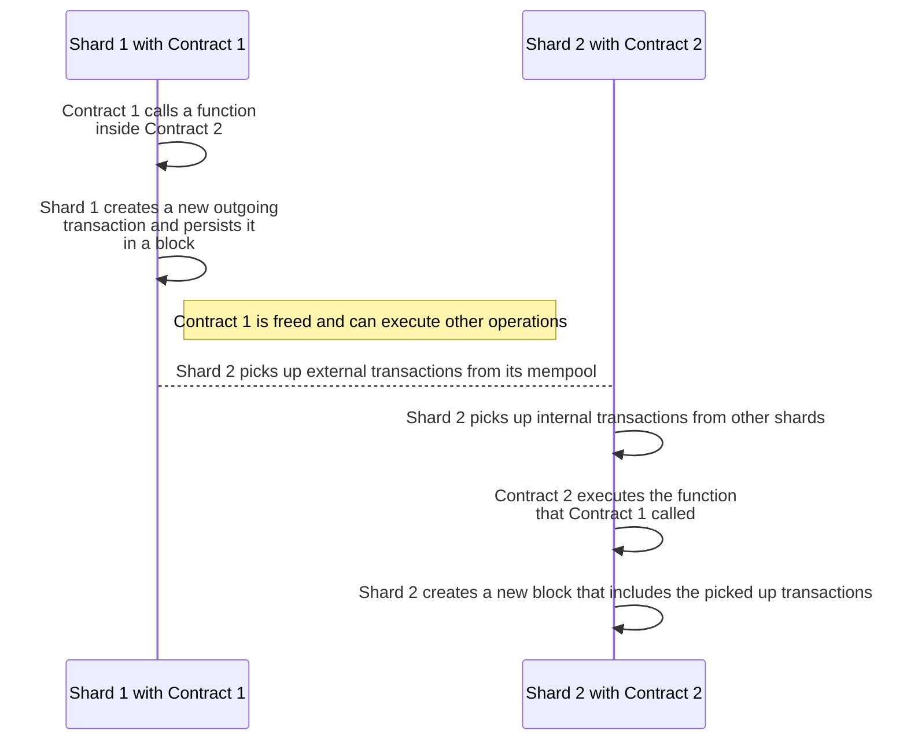

# Shards and parallelized execution

## Definition

Shards are smaller chains that are usually responsible for managing a portion of the global state of the main chain. In =nil;, there exist two types of shards.

* Execution shards process transactions that target the accounts located on these shards
* The consensus shard coordinates execution shards and submits ZKPs of the global state to Ethereum

## Execution shards

All work related to processing transactions, managing cross-shard communications, storing accounts, and overseeing the local state occurs at the execution shard level. Execution shards are also tasked with managing transaction passing checks.

:::info[Mempools]

In =nil;, only transactions that are sent by external actors (e.g., users or dApps) go to the mempool before being executed. Transactions that are exchanged between smart contracts are not added to the mempool.  

:::

:::info

Although each shard has its own mempool, there are no restrictions for the participants on what shard they can cooperate with.

:::

### Transaction passing checks

Transactions in =nil; can either be incoming or outgoing:

* Incoming transactions trigger contract execution.
* Outgoing transactions are spawned by contracts as part of execution. These outgoing transactions are sent to other contracts located on various shards.

To support [**cross-shard communications**](../getting-started/essentials/handling-async-execution.mdx), execution shards must record all necessary outgoing transactions posted in other execution shards.

Each transaction contains information about its destination account. If a shard sees that a transaction targets one of the accounts in the shard, the shard must include this transaction in its next block. Such outgoing transactions are called necessary transactions and new blocks are considered invalid unless they include all necessary transactions.

:::info

As the number of execution shards grows, this process may be changed so that shards are only tasked with tracking transactions from their neighbors. The closeness of shards can be determined by their Hamming distance.

:::

### Async execution

Generally, the term 'async execution' describes delegating the completion of a task to a dedicated CPU thread or a similar isolated component. While this task is processed, the main program can freely execute other instructions, and then react to receiving the results of the async task.

In =nil; async execution functions differently: any contract (the caller) may perform an async call to any other contract (the receiver). An async call spawns a transaction, and the execution of the call is delayed until this transaction is processed by the shard where the receiver is located. The time taken to execute an async call may vary, and the caller contract is free to execute other instructions without having to wait for the results of the call.

Consider two contracts deployed on two different shards in =nil;:

* Contract 1 (caller) is deployed on Shard 1
* Contract 2 (receiver) is deployed on Shard 2

The below diagram displays how an async call could work between Contract 1 and Contract 2.

The key stages of this flow are:

1. Contract 1 calls a function inside Contract 2, which creates a new outgoing transaction
2. Shard 2 must copy this transaction and execute it
3. When Shard 2 processes the transaction, Contract 2 executes the function that Contract 1 called

For an in-depth explanation of how to perform and manage async calls, [**read this tutorial**](../getting-started/essentials/handling-async-execution.mdx).

:::info

All shards 'listen' to the latest blocks created by other shards. When creating a block, a shard must copy transactions from other shards that have this shard as its destination. These transactions do not go through the mempool and, therefore, cannot be lost.

:::

:::info[Callback pattern]

There is also a variation of the above flow in which the function inside Contract 2 makes an async call back to Contract 1.

In this case, the flow would work as follows:

1. Contract 1 calls a function inside Contract 2, creating a new outgoing transaction copied by Shard 2
2. Shard 2 processes the transaction, and Contract 2 calls the requested function
3. As part of executing the function, Contract 2 makes an async call back to Contract 1
4. Shard 1 picks up the new transaction from Shard 2 and executes it
5. Contract 1 performs whatever operation was requested by Contract 2

As shown above, the async call inside Contract 2 effectively becomes a callback function for Contract 1. Note that the use of this pattern is only possible if Contract 1 or Contract 2 share the same owner (or their owners cooperate with each other).

:::

### Internal vs. external transactions 

In =nil;, transactions are divided into internal and external.

Internal transactions cover all types of async communication between smart contracts on the network regardless of the shard where they are deployed. When Contract 1 (deployed on Shard 1) calls a function in Contract 2 (deployed on Shard 2), Shard 1 spawns an internal transaction and Shard 2 processes this transaction. Note that sync calls between contracts do not produce any transactions.

External transactions can originate only in one case: when any entity that exists outside of the cluster (e.g., a dApp) sends a transaction to any smart contract on the network.

:::info[Payment for transactions]

For internal transactions, the transaction itself is the 'payer' entity. An internal transaction spends its `value` to cover processing costs. Note that the transaction only pays for the initial call to a 'top-level' smart contract. If the transaction produces a chain of sync calls, the transaction will only pay for the first call in the chain.

For external transactions, the receiving contract is the 'payer' entity. To process external transactions, the receiving contract must implement a special function that uses arbitrary logic to verify these transactions. If this function is absent, the contract will only accept internal transactions. A more detailed explanation of how a contract may receive external transactions is [**given in a practical tutorial**](../getting-started/essentials/receiving-ext-transactions).

Regardless of the transaction type, the 'payer' is tasked with purchasing gas equal to the transaction `gasLimit`. The transaction fails if the balance of the 'payer' is insufficient. If execution is successful, the remaining gas is refunded to the 'payer'.

:::

## Consensus shard

In contrast to execution shards, [**the consensus shard**](../specification/principles.mdx) is responsible for the following functions:

* Managing global consensus
* Producing 'master' ZKPs for verifying global state changes
* Setting the protocol rules and parameters

:::note[Security guarantees]

Although =nil; relies on ZKPs to verify state transitions statelessly, ZKPs can be costly to generate. As a result, a standard security protocol is used to provide security guarantees while ZKPs are generated.

The committee of an execution shard runs a [**Multi-Threshold BFT security protocol**](https://dl.acm.org/doi/10.1145/3460120.3484554) which is a varioation of Sync HotStuff. This is done so that the safety threshold at the local level is not tied to the safety threshold of the cluster.

After running the local consensus protocol, leaders of all committees transmit block digests and quorum certificates to the leader of the consensus shard. The consensus shard leader then proposes a new block to the consensus shard committee, which includes the entire set of validators. These validators run a HotStuff-2 consensus protocol to achieve global consensus.

:::
