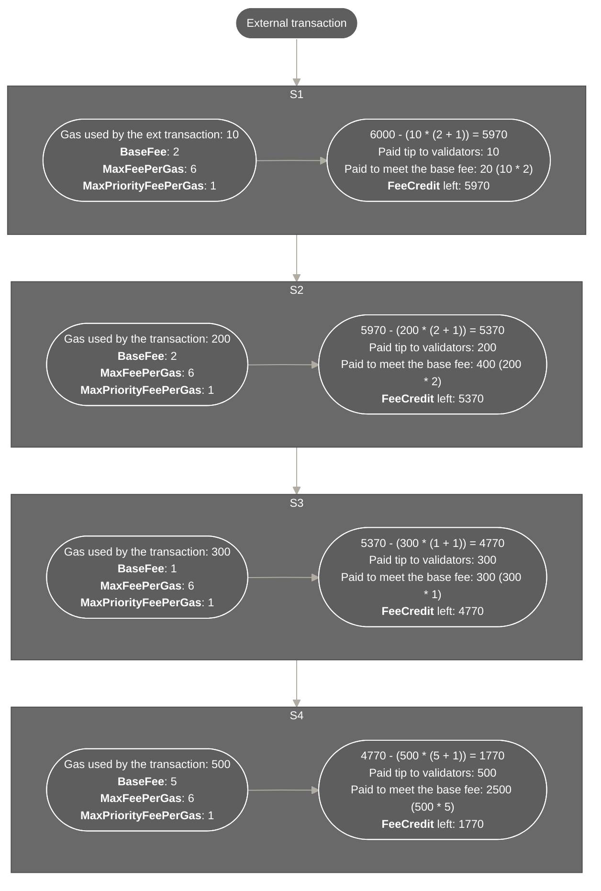

# Gas and value

## Definition

In nil;, every transaction has two fields responsible for handling gas and value:

* `FeeCredit`
* `Value`
* `MaxPriorityFeePerGas`
* `MaxFeePerGas`

`FeeCredit` is the maximum possible amount of tokens the transaction sender is willing to pay for transaction execution. `Value` is the amount of =nil; base tokens to be debited to another smart account. 

`MaxFeePerGas` is the limit set on the total price of gas that the sender is willing to pay for transaction processing. These two fields ensure that transaction processing on =nil; is handled similarly to Ethereum with only marginal differences.

Each shard also has a `BaseFee` which is the gas price that determines whether a transaction is eligible to be included in a block. If the sender is not willing to pay at least the `BaseFee` when specifying the gas price, their transaction will be rejected. Similarly to Ethereum, `BaseFee` is history-dependent and fluctuates depending on shard congestion. 

In turn, `MaxPriorityFeePerGas` refers to the maximum possible additional price per gas that should act as a reward for validators to prioritize processing a specific transaction. There can be cases where the actual priority fee is lower than the value of `MaxPriorityFeePerGas`. For example, if `BaseFee` plus `MaxPriorityFeePerGas` is higher than `MaxFeePerGas`, the validator reward will be reduced so that the total gas price matches `MaxFeePerGas`.  

:::info

`FeeCredit` is an estimate created by the transaction sender rather than a precisely calculated transaction execution fee. To evaluate whether a given fee credit would be enough to make a call, use the `nil smart-account estimate-fee ADDRESS FUNC_NAME [ARGS]` command.

To estimate gas in a different way, use the `eth_estimateFee` JSON-RPC method or the `nil smart-account call-readonly ADDRESS` command while providing the `--with-details` flag. Note that this command may sometimes produce the `"out of gas"` response which should not be considered an error.

:::

:::info

If a transaction is made to a non-payable function, and `Value` is not zero, execution will be reverted as the contract will not be able to accept the transferred tokens.

:::

:::info

If `MaxFeePerGas` is less than `BaseFee`, a transaction is bounced automatically unless it is the original external transaction that is sent from a user or a dApp to the cluster at the beginning of a call chain.

:::

## Example

Consider the following example of an async transaction that triggers an async call chain. The transaction has the following properties:

* `FeeCredit`: 6000
* `MaxPriorityFeePerGas`: 1
* `MaxFeePerGas`: 6

As shown above, `MaxFeePerGas` and `MaxPriorityFeePerGas` are always propagated across the entire async call chain. This means that the transaction sender can never be charged more than their absolute maximum gas price.

:::note[Effective priority fee]

There may be cases when `BaseFee` plus the specified `MaxPriorityFeePerGas` is larger than the provided `MaxFeePerGas`. In this situation, the effective priority fee would be different compared to `MaxPriorityFeePerGas`.

The following formula is used to calculate the effective priority fee when `MaxFeePerGas` is larger than `BaseFee`:

$$
min(MaxPriorityFeePerGas, MaxFeePerGas - BaseFee)
$$

A transaction is rejected if both of the below conditions are true:

* `MaxFeePerGas` is less than `BaseFee`
* The transaction is not the original external transaction that was sent by a user or a dApp to the cluster

:::

:::note[Payment for sync calls]

Payment for sync calls uses the same fields and the same mechanism. 

Unless they trigger new async calls, sync calls do not spawn additional transactions. This makes it possible to easily revert failed sync calls. For example, if someone sends an external transaction which triggers a sync call, and the call reverts for any reason, the initial external transaction is also reverted.

If a sync call triggers an async call, the resulting async call chain is processed according to [**the specified gas forwarding rules**](../smart-contracts/gas-forwarding.mdx).

:::

