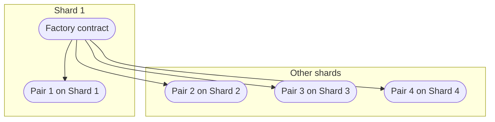

import Tabs from '@theme/Tabs'
import TabItem from '@theme/TabItem'

# Migrating dApps to =nil;

This guide details how an existing dApp or a set of smart contracts can be safely migrated to =nil; while improving scalability via sharding.

To illustrate the migration process, the guide uses examples from [**Uniswap V2 =nil;**](https://github.com/NilFoundation/nil/tree/main/uniswap), which is a conversion of Uniswap V2 that leverages sharding and async communications. This example is chosen for several reasons:

* Uniswap V2 is a well-known protocol that is easy to implement
* The core tenets of Uniswap v2 (token pairs and the pair factory) provide many areas that can be made more scalable by distributing pair contracts across different shards
* Converting Uniswap v2 illustrates the potential issues and blockers that may arise when simply copying and pasting existing dApps to =nil;

:::info

[**Watch this video**](../vids/uniswap-v2.mdx) to learn more about Uniswap v2 =nil;.

:::

## Overview of the migration process

The dApp migration process can be separated into three key stages.

1. Perform the initial deployment

'Copy-and-paste' the dApp to =nil; and deploy all of its components on a single shard. Within the confines of one shard, =nil; is fully EVM-compatible and any dApp can be easily redeployed from regular Ethereum.

2. Support the new multi-token model and async communications

Deprecate the usage of the ERC-20 standard, replacing it with how multi-token support is implemented on =nil;. Switch communications between smart contracts to use async calls. This will allow for placing different components of the dApp on different execution shards, improving scalability.

3. Optimize the architecture

Maximize performance and safety by mixing async communications with sync communications where relevant.

The following sections expand on points 2 and 3.

## Leveraging sharding

Sharding improves scalability by allowing for 'delegating' work to several shards at once. This creates a system similar to parallel processing: each shard can communicate with each other without having to freeze contract execution to do so.

For Uniswap v2 =nil;, this means that the factory contract can stay on one shard while token pairs can be deployed in multiple shards to avoid congestion:



The key decision when migrating apps to =nil; is what parts of the app can be separated and divided between shards. In Uniswap v2, the factory contract is a singleton while new token pairs can be deployed at any time, which aligns perfectly with the sharding paradigm. In other projects or dApps, separation of logic between shards may be more difficult.

:::info[How the factory contract works]

The [**`UniswapV2Factory`**](https://github.com/NilFoundation/nil/tree/main/uniswap/contracts/UniswapV2Factory.sol) contract uses two methods from the `Nil.sol` extension library:

* `calculateAddress()`
* `asyncCall()`

`calculateAddress()` determines the address of a pair contract given its bytecode, salt, and the shard where it should be deployed. `asyncCall()` simply sends a transaction to this address containing the contract bytecode, salt, the shard id, and the `deploy` flag set to `true`.

```solidity showLineNumbers
function deployPair(uint256 salt) private returns (address deployedAddress) {
        bytes memory code = abi.encodePacked(type(UniswapV2Pair).creationCode, abi.encode(msg.sender));
        address contractAddress = Nil.createAddress(1, code, salt);
        Nil.asyncCall(contractAddress, address(0), msg.sender, 0, 0, true, 0, abi.encodePacked(code, salt));
        return contractAddress;
    }
```

This makes it possible to easily deploy token pairs on any shard. Since the contract address is calculated based on the shard where the contract is deployed, there is no need to store a separate mapping of shard IDs and token pair addresses.

:::

Contracts deployed on different shards can freely communicate with each other. However, sending transactions across shards asynchronously can result in issues (e.g., token price slippages) since there it is [**impossible to know when exactly an async call will be executed**](../core-concepts/shards-parallel-execution.mdx#async-execution). In contrast, sync calls can be reliably executed one-by-one.

During migration, a simple workaround can be used to always use the safest messaging method available:

```solidity showLineNumbers
function smartCall(address dst, Nil.Token[] memory tokens, bytes memory callData) private returns (bool) {
    if (Nil.getShardId(dst) == Nil.getShardId(address(this))) {
        (bool success,) = Nil.syncCall(dst, gasleft(), 0, tokens, callData);
        return success;
    } else {
        Nil.asyncCall(dst, address(0), address(0), 0, Nil.FORWARD_REMAINING, false, 0, tokens, callData);
        return true;
    }
}
```

This ensures that synchronous communications are always used when the transaction recipient is located on the same shard as the transaction sender. `smartCall()` or a similar workaround can be used when there is no need for fine-grain control over which contracts are deployed to which shards.

## Migration of token pairs

In =nil;, the ERC20 standard is absent. It is replaced by a more intuitive system in which any smart contract can be a token and support all essential operations (minting, transferring and burning) as long as this smart contract is derived from `NilTokenBase`:

```solidity file=../../tests/Token.sol start=startTokenContract end=endTokenContract
```

:::tip[Key differences]

In =nil;, there is no need to send tokens to a dedicated ERC20 contract to receive approval for minting/burning/transferring. Any smart contract holding a custom token can send this token directly to other smart contracts in [**an async or a sync call**](../key-principles/async-execution.mdx).

:::

After `NilTokenBase` is imported, the contract can mint and burn its own token whose ID is derived from the address of the contract. This approach provides encapsulation for all typical actions performed on token pairs (such as minting and burning liquidity tokens during the first mint).

:::info[Additional information]

[**Read this tutorial**](../key-principles/tokens.mdx) to learn more about minting, burning and transferring tokens.

:::

:::info[Full minting flow]

Here is a simplified overview of how token pairs function on =nil;:

1. Every token pair contract can generate its own tokens which act as liquidity pool (LP) shares
2. When minting, the user sends the tokens in the token pair directly when calling the `mint()` method. There is no need to send any calls to the ERC20 contract
3. The tokens are deposited to the token pair prior to executing minting
4. The pair mints LP shares that can be sent back to the user

:::

In Uniswap v2 =nil;, the [**revised `UniswapV2Pair` contract**](https://github.com/NilFoundation/nil/tree/main/uniswap/contracts/UniswapV2Pair.sol) uses methods inherited from `NilTokenBase` when minting new tokens:

<Tabs groupId='internalMethods'>
  <TabItem value='nil' label='Uniswap v2 =nil;'>
    ```solidity showLineNumbers
    function mint(address to) public lock returns (uint liquidity) {
        (uint256 _reserve0, uint256 _reserve1) = getReserves(); // gas savings
        uint balance0 = Nil.tokenBalance(address(this), tokenId0);
        uint balance1 = Nil.tokenBalance(address(this), tokenId1);

        uint amount0 = balance0.sub(_reserve0);
        uint amount1 = balance1.sub(_reserve1);
        uint _totalSupply = totalSupply; // gas savings, must be defined here since totalSupply can update in _mintFee

        if (_totalSupply == 0) {
            liquidity = Math.sqrt(amount0.mul(amount1)).sub(MINIMUM_LIQUIDITY);
            totalSupply = totalSupply + liquidity; // permanently lock the first MINIMUM_LIQUIDITY
        } else {
            liquidity = Math.min(
                amount0.mul(_totalSupply) / _reserve0,
                amount1.mul(_totalSupply) / _reserve1
            );
        }
        require(liquidity > 0, "UniswapV2: INSUFFICIENT_LIQUIDITY_MINTED");

        mintTokenInternal(liquidity);
        sendTokenInternal(to, getTokenId(), liquidity);
        _update(balance0, balance1, _reserve0, _reserve1);
        // if (feeOn) kLast = uint(reserve0).mul(reserve1); // reserve0 and reserve1 are p-to-date
        emit Mint(msg.sender, amount0, amount1);
    }
    ```
  </TabItem>
  <TabItem value='original' label='Original Uniswap v2'>
    ```solidity showLineNumbers
    function mint(address to) external lock returns (uint liquidity) {
        (uint112 _reserve0, uint112 _reserve1,) = getReserves(); // gas savings
        uint balance0 = IERC20(token0).balanceOf(address(this));
        uint balance1 = IERC20(token1).balanceOf(address(this));
        uint amount0 = balance0.sub(_reserve0);
        uint amount1 = balance1.sub(_reserve1);

        bool feeOn = _mintFee(_reserve0, _reserve1);
        uint _totalSupply = totalSupply; // gas savings, must be defined here since totalSupply can update in _mintFee
        if (_totalSupply == 0) {
            liquidity = Math.sqrt(amount0.mul(amount1)).sub(MINIMUM_LIQUIDITY);
           _mint(address(0), MINIMUM_LIQUIDITY); // permanently lock the first MINIMUM_LIQUIDITY tokens
        } else {
            liquidity = Math.min(amount0.mul(_totalSupply) / _reserve0, amount1.mul(_totalSupply) / _reserve1);
        }
        require(liquidity > 0, 'UniswapV2: INSUFFICIENT_LIQUIDITY_MINTED');
        _mint(to, liquidity);

        _update(balance0, balance1, _reserve0, _reserve1);
        if (feeOn) kLast = uint(reserve0).mul(reserve1); // reserve0 and reserve1 are up-to-date
        emit Mint(msg.sender, amount0, amount1);
    }
    ```
  </TabItem>
</Tabs>

When migrating an app to =nil; make sure to adapt the code that was using the ERC20 standard to instead use the corresponding methods from `NilTokenBase`.

There are also differences in how attaining token balances works in =nil;:

<Tabs groupId='tokenBalance'>
  <TabItem value='nil' label='Uniswap v2 =nil;'>
    ```solidity showLineNumbers
    uint balance0 = Nil.tokenBalance(address(this), tokenId0);
    ```
  </TabItem>
  <TabItem value='original' label='Original Uniswap v2'>
    ```solidity showLineNumbers
    uint balance0 = IERC20(token0).balanceOf(address(this));
    ```
  </TabItem>
</Tabs>

The =nil; implementation uses the token ID to check its balance rather than its address.

## Async vs sync calls

In =nil;, contracts can be deployed on  shards with each shard acting as a separate blockchain. While communications on Ethereum are entirely synchronous, =nil; allows for async communications. Contracts can send transactions to other contracts located on different shards without having to stop execution and wait for the transaction results.

:::info[Additional information]

[**Read this tutorial**](../key-principles/async-execution.mdx) to learn more about minting, burning and transferring tokens.

:::

Async calls are used in several different areas of Uniswap v2 =nil; including contract deployment in [**`UniswapV2Factory`**](https://github.com/NilFoundation/nil/tree/main/uniswap/contracts/UniswapV2Factory.sol):


<Tabs groupId='pairDeployment'>
  <TabItem value='nil' label='Uniswap v2 =nil;'>
    ```solidity showLineNumbers
    function deployPair(uint256 shard, uint256 salt) private returns (address deployedAddress) {
        bytes memory code = abi.encodePacked(type(UniswapV2Pair).creationCode, abi.encode(msg.sender));
        address contractAddress = Nil.createAddress(shard, code, salt);
        Nil.asyncCall(contractAddress, address(0), msg.sender, 0, 0, true, 0, abi.encodePacked(code, salt));
        return contractAddress;
    }

    function createPair(
        address tokenA,
        address tokenB,
        uint256 salt,
        uint256 shard
    ) public returns (address pair) {
        require(tokenA != tokenB, "UniswapV2: IDENTICAL(_ADDRESSES");
        (address token0, address token1) = tokenA < tokenB
            ? (tokenA, tokenB)
            : (tokenB, tokenA);
        require(token0 != address(0), "UniswapV2: ZERO_ADDRESS");
        require(
            getPair[token0][token1] == address(0),
            "UniswapV2: PAIR_EXISTS"
        );
        pair = address(deployPair(shard, salt));


        getPair[token0][token1] = pair;
        getPair[token1][token0] = pair;
        allPairs.push(pair);

        emit PairCreated(token0, token1, pair, allPairs.length);
    }
    ```
  </TabItem>
  <TabItem value='original' label='Original Uniswap v2'>
    ```solidity showLineNumbers
    function createPair(address tokenA, address tokenB) external returns (address pair) {
        require(tokenA != tokenB, 'UniswapV2: IDENTICAL_ADDRESSES');
        (address token0, address token1) = tokenA < tokenB ? (tokenA, tokenB) : (tokenB, tokenA);
        require(token0 != address(0), 'UniswapV2: ZERO_ADDRESS');
        require(getPair[token0][token1] == address(0), 'UniswapV2: PAIR_EXISTS'); // single check is sufficient
        bytes memory bytecode = type(UniswapV2Pair).creationCode;
        bytes32 salt = keccak256(abi.encodePacked(token0, token1));
        assembly {
            pair := create2(0, add(bytecode, 32), mload(bytecode), salt)
        }
        IUniswapV2Pair(pair).initialize(token0, token1);
        getPair[token0][token1] = pair;
        getPair[token1][token0] = pair; // populate mapping in the reverse direction
        allPairs.push(pair);
        emit PairCreated(token0, token1, pair, allPairs.length);
    }
    ```
  </TabItem>
</Tabs>

While the original implementation uses opcode deployment, the =nil; conversion simply sends a call to the calculated address containing the bytecode of the pair contract. This offers two advantages:

* The factory contract can stay on one shard while token pairs can be deployed on any number of different shards
* The factory does not have to freeze execution while contract pairs are being deployed

Consider replacing opcode deployment with deployment via async call when migrating apps to =nil;.

Async calls can also be used to send transactions to token pair contracts. Here is an example of using `asyncCall()` to swap tokens:

```solidity showLineNumbers
Nil.asyncCall(
  Token_PAIR_ADDRESS,
  address(this),
  0,
  abi.encodeWithSignature("swap(uint, uint, address)", AMOUNT_ONE, AMOUNT_TWO, address(this))
);
```

This should avoid locking the execution of the contract that makes the async call until the tokens are swapped by the pair contract.

Note that it is also possible to use async calls to send custom tokens between contracts:

```solidity file=../../tests/AsyncToken.sol start=startAsyncTokenContract end=endAsyncTokenContract
```

Tokens can be extracted from any transaction by using `Nil.txnTokens()` and then passed to the `asyncCallWithTokens()` method. When migrating a dApp to =nil;, do not hesitate to deploy contracts on different shards: they will still be able to send and receive tokens from contracts on other shards.

