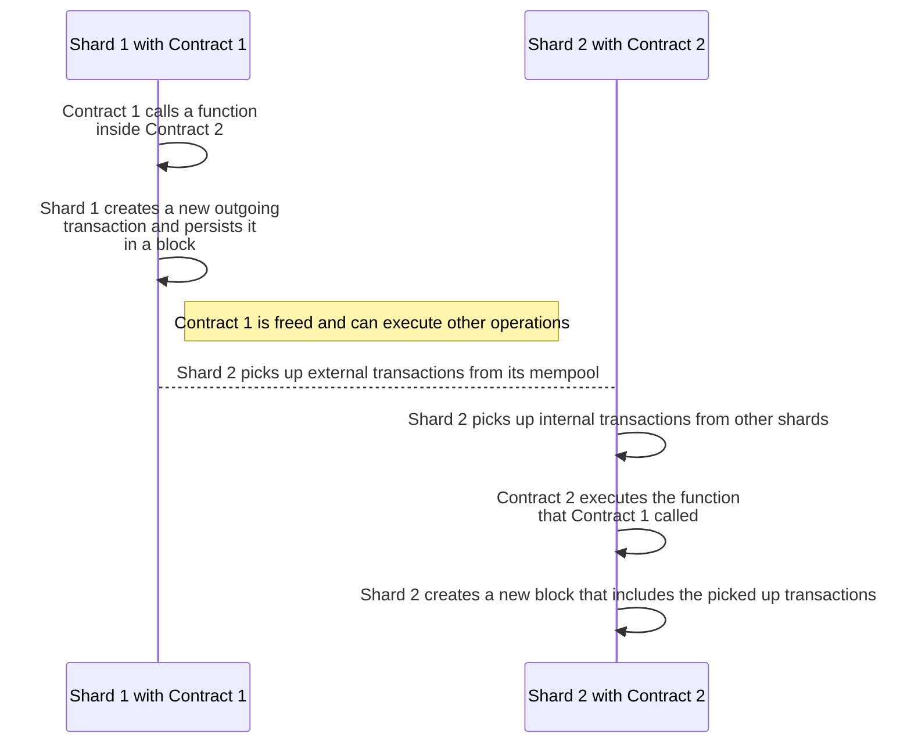

# Async execution

## Definition

Generally, the term 'async execution' describes delegating the completion of a task to a dedicated CPU thread or a similar isolated component. While this task is processed, the main program can freely execute other instructions, and then react to receiving the results of the async task.

In =nil; async execution functions differently: any contract (the caller) may perform an async call to any other contract (the receiver). An async call spawns a transaction, and the execution of the call is delayed until this transaction is processed by the shard where the receiver is located. The time taken to execute an async call may vary, and the caller contract is free to execute other instructions without having to wait for the results of the call.

To learn more about performing async calls in Solidity contracts, [**click here**](../smart-contracts/handling-async-execution.mdx).

## Example

Consider two contracts deployed on two different shards in =nil;:

* Contract 1 (caller) is deployed on Shard 1
* Contract 2 (receiver) is deployed on Shard 2

The below diagram displays how an async call could work between Contract 1 and Contract 2.

The key stages of this flow are:

1. Contract 1 calls a function inside Contract 2, which creates a new outgoing transaction
2. Shard 2 must copy this transaction and execute it
3. When Shard 2 processes the transaction, Contract 2 executes the function that Contract 1 called

:::info

All shards 'listen' to the latest blocks created by other shards. When creating a block, a shard must copy transactions from other shards that have this shard as its destination. These transactions do not go through the mempool and, therefore, cannot be lost.

:::

:::info[Callback pattern]

There is also a variation of the above flow in which the function inside Contract 2 makes an async call back to Contract 1.

In this case, the flow would work as follows:

1. Contract 1 calls a function inside Contract 2, creating a new outgoing transaction copied by Shard 2
2. Shard 2 processes the transaction, and Contract 2 calls the requested function
3. As part of executing the function, Contract 2 makes an async call back to Contract 1
4. Shard 1 picks up the new transaction from Shard 2 and executes it
5. Contract 1 performs whatever operation was requested by Contract 2

As shown above, the async call inside Contract 2 effectively becomes a callback function for Contract 1. Note that the use of this pattern is only possible if Contract 1 or Contract 2 share the same owner (or their owners cooperate with each other).

:::