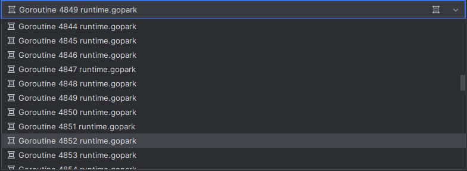
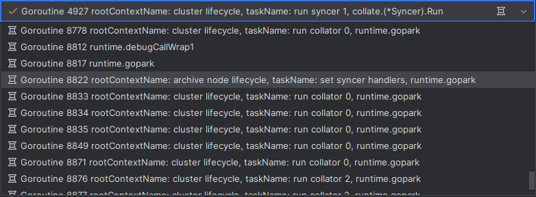

# Debugging

## Finding Goroutines During Debugging

When encountering a deadlock, an effective technique can be to find the goroutine that is in an infinite wait.
Finding the right one among hundreds of `runtime.gopark` in the list of goroutines in the IDE debugger
can be a challenging task.

Goroutine labels come to the rescue. To see them, you need to add an additional `debugger` tag to the build tags.
After that, tasks started through `RunWithTimeout` will have informative labels.

You can read more in the JetBrains [blog article](https://blog.jetbrains.com/go/2020/03/03/how-to-find-goroutines-during-debugging/#using-a-custom-library-to-enable-debugging-labeling
).

_BEFORE_

_AFTER_

