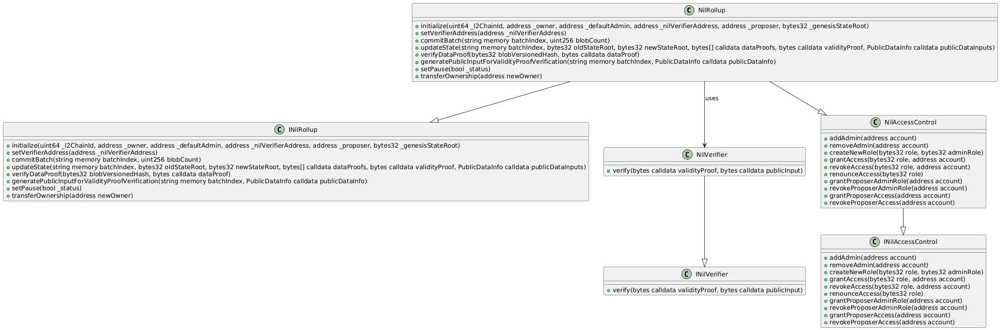
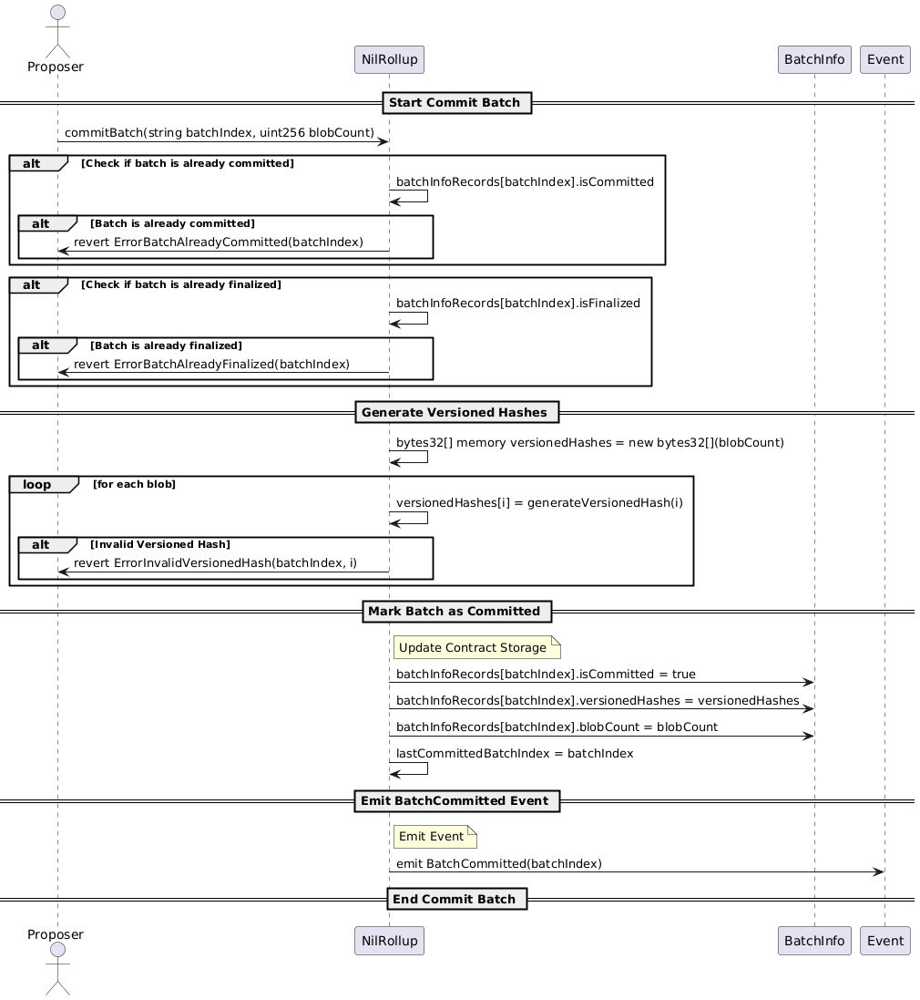
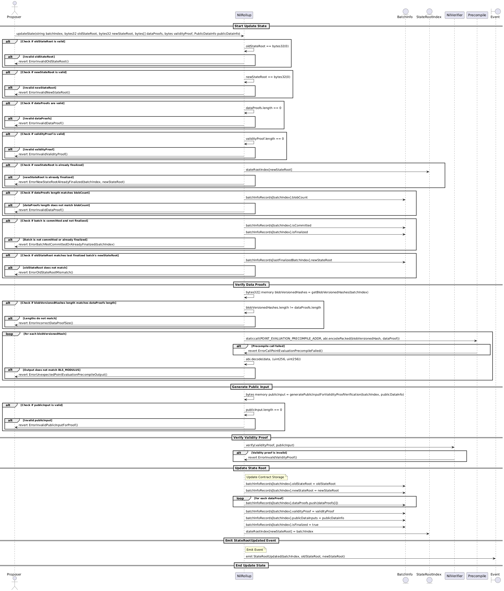
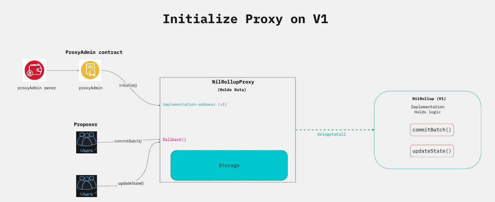
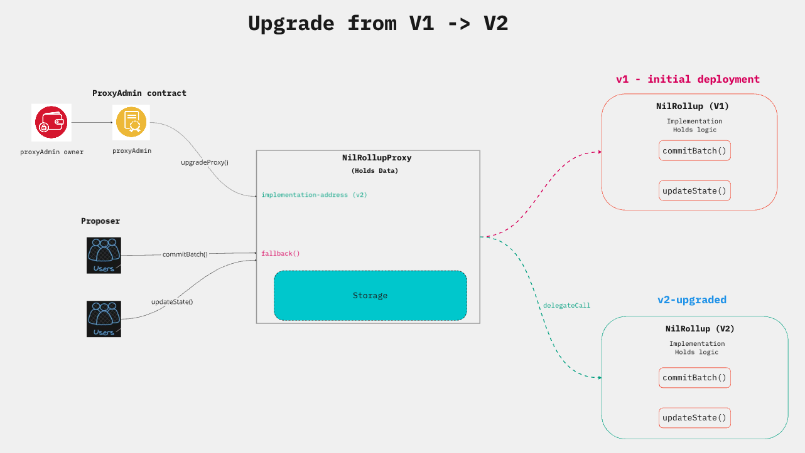
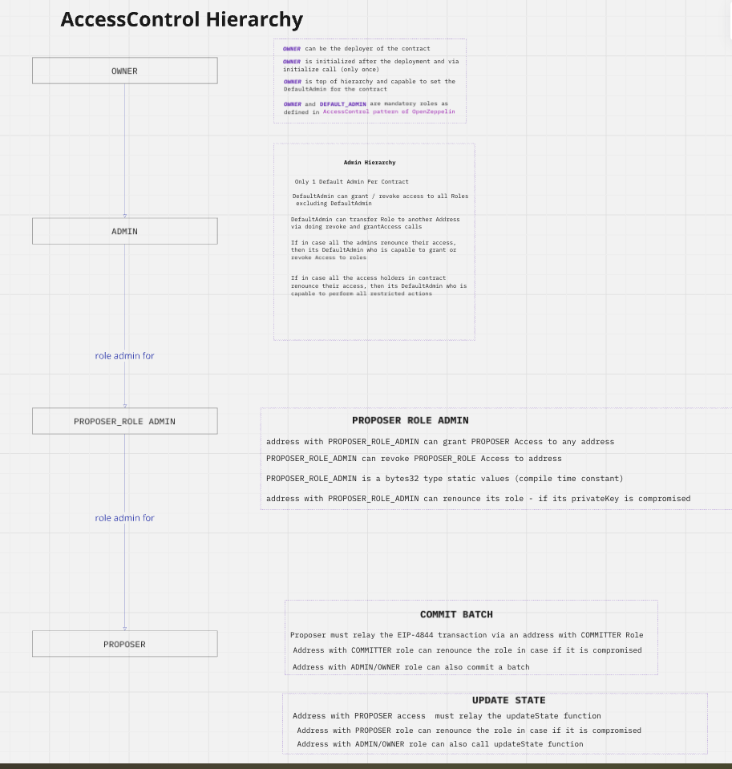

# Nil L1-Contracts

This smart-contracts module contains all the L1 contracts that are to be deployed on mainnent & sepolia testnet
Solidity smart contracts in the repository are used for proof verification and state root updates of L2 on the L1 chain

1. NilRollup
2. NilVerifier

Contract Architecture


Contract Components


## NilRollup

- NilRollup contract is the entrypoint contract for batch commits and proof verifications initiated by syncCommittee

- NilRollup contract contains 2 main functions:
   1. [commitBatch](./contracts/NilRollup.sol#L284)
   2. [updateState](./contracts/NilRollup.sol#L322)


### commitBatch Logic



### updateState Logic




### ContractUpgradeability

   1. [NilRollup](./contracts/NilRollup.sol) is deployed as a TransparentUpgradeableProxy contract
   2. NilRollupProxy is managed by a ProxyAdmin for all upgrade operations
      - ProxyAdmin is a smartContract Account deployed during the NilRollupProxy deployment
      - ProxyAdmin is owned by the deployer who has initiated the deployment
      - Deployer can transfer the proxyAdmin ownership to another address (multisig wallet)
   3. NilRollupProxy owns all storage variables under [NilRollup](./contracts/NilRollup.sol#L100)

 #### Deploy and Initialize Proxy

   

#### Upgrade Proxy

   

### AccessControl
   1. NilRollup follows access-control hierarchy starting from owner controlling entire contract upgrades and operational updates
   2. OpenZeppelin's enumerable-AccessControl pattern is implemented to handle the hierarchy of access control
   3. hierarchy tree follows the path:
      ```
      OWNER_ROLE -> ADMIN_ROLE -> PROPOSER_ROLE
      ```
   4. each role has a corresponding ROLE_ADMIN who is responsible to grant/revoke the role access to any address
   5. each role in the hierarchy has specific responsibility
      - Any address with OWNER role can perform owner operations such as upgrade proxy and update the verifier address
      - Any address with ADMIN role can perform admin operations such as update the verifier address
      - Any address with PROPOSER role can perform `commitBatch` and `updateState` function calls
      - As a fallback support in hierarchy ADMIN can perform all admin operations and also the operations allowed for PROPOSER
      - As a fallback support in hierarchy, a OWNER can perform all owner, admin and proposer specific actions 

   | ROLE  | ROLE_ADMIN |  Description |
   | -| - | - |
   | OWNER | OWNER | Only 1 Owner can exist |
   | DEFAULT_ADMIN | OWNER | DefaultAdmin role can be granted/revoked by owner of the contract |
   | PROPOSER | DEFAULT_ADMIN | Proposers can be granted/revoked by defaultAdmin of the contract |

   6. Reason for using DEFAULT_ADMIN instead of ADMIN: Openzeppelin library follows the DEFULT_ADMIN keyword as thats the default admin in the contract 
      DefaultAdmin can create more Admins.

   7. Role Assignment during initialisation of contract

      | ROLE | Granted Roles |
      | - | - |
      | Owner | Owner, DefaultAdmin, Proposer |
      | Admin | Admin, Proposer |
      | Proposer | Proposer |

      - This backup assignment is done to make sure the address top in hierarchy is capable of doing all actions that it's sub-ordinate can do
      - This is configurable and can be changed to restrict the roles to specific addresses too i.e let proposer actions be done by specific address with exclusive access to PROPOSER

   


## NilVerifier

1. [NilVerifier-Contract](./contracts/verifier/NilVerifier.sol) contains the [verify](./contracts/verifier/NilVerifier.sol#L9) proof logic
2. NilVerifier contract is non-upgradeable and stateless contract
3. verification code is generated by zk-circuit (circuit for validityProof generation)
4. any changes to the zk-circuit needs changes to NilVerifier and re-deployment of Verifier contract
5. NilRollupProxy contract contains NilVerifierAddress and invokes the `verify` function to verify the `validityProof` during [updateState](./contracts/NilRollup.sol#L322) function execution. 
3. publicInputHash used in verification of validityProof is generated by the NilRollup contract using the [data-points](./contracts/interfaces/INilRollup.sol#L25) [generated by the offchain component: `syncCommitee`]

## Proof Generation

- Offchain Golang helper  code to generate proofs
  [l2-blob-proof-playground](./l2-blob-proof-playground/readme.MD)

## Dependencies

### Node.js

First install [`Node.js`](https://nodejs.org/en) and [`npm`](https://www.npmjs.com/).
Run the following command to install [`yarn`](https://classic.yarnpkg.com/en/):

```bash
npm install --global yarn
```

### Foundry

Install `foundryup`, the Foundry toolchain installer:

```bash
curl -L https://foundry.paradigm.xyz | bash
```

If you do not want to use the redirect, feel free to manually download the `foundryup` installation script from [here](https://raw.githubusercontent.com/foundry-rs/foundry/master/foundryup/foundryup).

Then, run `foundryup` in a new terminal session or after reloading `PATH`.

Other ways to install Foundry can be found [here](https://github.com/foundry-rs/foundry#installation).

### Hardhat

Run the following command to install [Hardhat](https://hardhat.org/) and other dependencies.

```
yarn install
```

## Build

1. run the setup script to:
  - download all node dependencies
  - download the git submodules
  - hardhat clean & compile
  - forge build, clean and compile

```sh
npm run setup
```

2. copy `.env.example` to `.env`

3. set all pre-requisite variables in .env
   - WALLET_ADDRESS
   - PRIVATE_KEY

- This address is same as the address used for deployment and acts as the owner of the NilChain contract
- The address is to be used when running SyncCommitee node


## Local Run

- For build pipeline or local testing, the contract is to be deployed on local Nil Node

### Please follow the steps mentioned below:

1. copy `.env.example` to `.env`
2. set all pre-requisite variables in .env

- WALLET_ADDRESS
- PRIVATE_KEY

3. This address is same as the address used for deployment and acts as the owner of the NilRollup contract

- Compilation:

   - hardhat compilation:

   ```shell
   npx hardhat compile
   ```

   - foundry compilation

   ```shell
   forge compile
   ```


# Deployment Steps:

## Deploy NilVerifier

```shell
npx hardhat deploy --network sepolia --tags NilVerifier
```

- script deploys and verifies the deployed contract on sepolia network


## Verify contract code for NilVerifier

- if the verification fails due to network connectivity or timeout issues, try to run this verification script
- remember to copy the deployed contract address from the console from previous step

```shell
npx hardhat run deploy/verify-nil-verifier.ts --network sepolia
```


## Deploy NilRollup as UpgradeableProxy contract 

```sh
npx hardhat deploy --network sepolia --tags NilRollup
```

- Console Output:

```
% npx hardhat deploy --network sepolia --tags NilRollup

Nothing to compile
No need to generate any newer typings.
Deploying NilRollup with the account: 0x7580E71C10e5023a46DD11F21116471dcd60C400
Verifying implementation: 0x72AB01Df6c96733370B469e4b521cE6fa24b833d
Verifying proxy: 0x30F82AbFdA51D5aeBd9aCcfe9350cC9635901205
```


## Verify contract code of NilRollup

- ensure to copy the `NilRollupProxy` contract deployed address from previous step
- set the value of `contractAddress` variable in verification script with the deployed contract address
- soon this will be refactored to refer to a json config grouped under network-json file

- script to verify the deployed NilRollup contract

```sh
npx hardhat run scripts/verify/verify-nil-rollup.ts --network sepolia
```

- console output of verification script

```
% npx hardhat run scripts/verify/verify-nil-rollup.ts --network sepolia
Verifying implementation: 0x72AB01Df6c96733370B469e4b521cE6fa24b833d
Successfully submitted source code for contract
contracts/v2/NilRollup.sol:NilRollup at 0x72AB01Df6c96733370B469e4b521cE6fa24b833d
for verification on the block explorer. Waiting for verification result...

Successfully verified contract NilRollup on the block explorer.
https://sepolia.etherscan.io/address/0x72AB01Df6c96733370B469e4b521cE6fa24b833d#code

Verifying proxy: 0x30F82AbFdA51D5aeBd9aCcfe9350cC9635901205
Linking proxy 0x30F82AbFdA51D5aeBd9aCcfe9350cC9635901205 with implementation
Successfully linked proxy to implementation.
Verifying proxy admin: 0x2423458DB2E15e4C7067344a95eEd365729F0047
```

## Go - Integration Code - TODO

1. Go function to generate a Blob transaction with sidecar
2. Send the Blob transaction on local Geth node
3. Assert if the batch is committed successfully on `NilRollup` contract on local Geth


## Smart Contract - Work In Progress - Items

1. 2 Stage Ownership Transfer
    - enhance the `NilRollup` ownership transfer from single stage to 2-stage transfer
    - current owner to nominate the new owner
    - new owner will be stored as `pending-owner`
    - new owner must accept the ownership to finalise the ownership transfer

2. Access-Control and Upgradeability Unit Tests
    - Test Access-Control scenarios (Grant, revoke)
    - Test `commitBatch` and `updateState` to role check for `PROPOSER` role
    - Test the Upgrade feature by creating a new Stub-V2 contract for `NilRollup` as `NilRollupV2Stub`
    - Add a new storage variable map to `NilRollupV2Stub` 
       - Assert that the existing storage is intact and not tampered with after the upgrade
       - Assert the mutation and query on new storage variable added as part of upgrade
       - Assert that the existing proxyAdmin is capable of doing multiple upgrade ops on Proxy

3. Error Revert Assertions
    - `NilRollup` contract has multiple revert errors during validation checks
    - Assert for all revert scenarios

4. Document all Test Scenarios for `NilRollup` features

5. AccessControl Ops - Scripts to `grant` , `revoke` roles

6. Ownership Transfer Ops - Scripts to transfer the ownership to another address

7. Scripts to check the Access roles for an address

8. Linting and Formatting Plugins for solidity code

9. Pre-Commit hook checks to trigger formatting and linting checks

10. Slither Plugin - Vulnerability and Static Analysis checks


## Outstanding Issues

1. `upgradeProxy` call on hardhat-openzeppelin is generating same implementation address despite changes in contract code
2. dive in to the source code of `upgradeProxy` and add console logs in the library code to debug during deployment 
3. Testing must be done on local `geth` as well as `anvil` node

